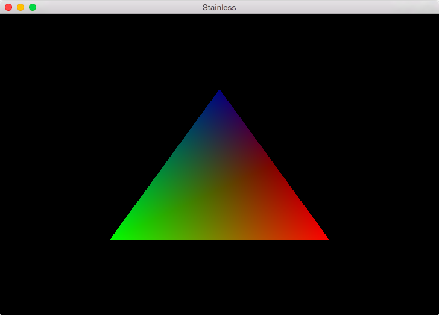

My OpenGL Practice [![Build Status][travis-i]][travis-a]
========

### Requirements

* **Rust**
* CMake
* *(on Linux)* libXxf86vm-dev

[travis-i]: https://travis-ci.org/simnalamburt/opengl-practice.svg?branch=master
[travis-a]: https://travis-ci.org/simnalamburt/opengl-practice
