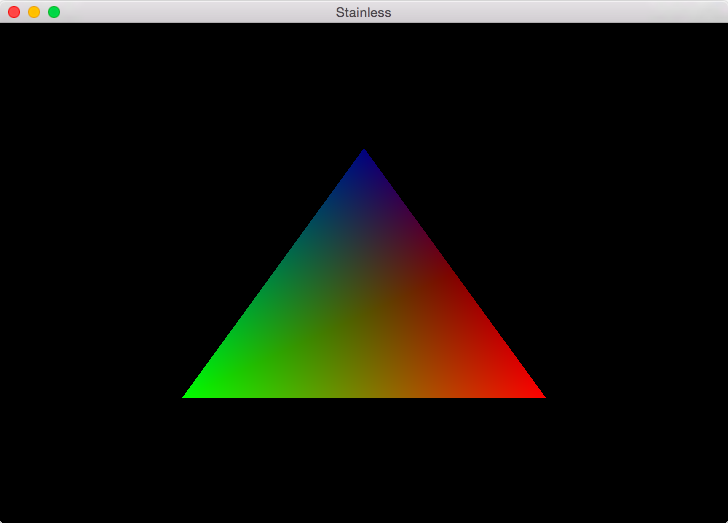

My OpenGL Practice [![travis-i][]][travis-a]
========

### Requirements

* **Rust**
* CMake
* *(Linux only)* libXxf86vm-dev libxinerama-dev libxcursor-dev

[travis-i]: https://travis-ci.org/simnalamburt/opengl-practice.svg?branch=master
[travis-a]: https://travis-ci.org/simnalamburt/opengl-practice
